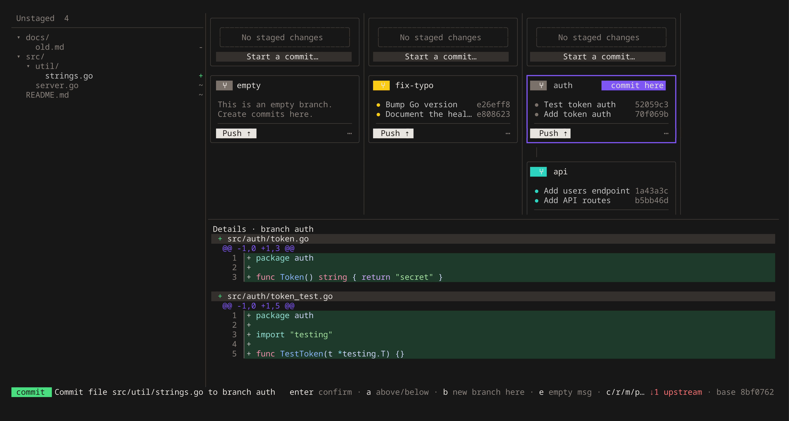

<p align="center">
  <picture>
    <source media="(prefers-color-scheme: dark)" srcset="brand/logo.svg">
    
  </picture>
</p>

<p align="center">
  <strong>Parallel</strong> agentic workflow<br>
  <strong>Code review</strong> your agent can act on<br>
  On top of <strong>GitButler</strong>
</p>

<p align="center">
  <a href="https://github.com/BartInTheField/buti/releases/latest">Install</a> ·
  <a href="docs/usage.md">Usage</a> ·
  <a href="docs/keys.md">Keys</a> ·
  <a href="https://github.com/BartInTheField/buti/issues/new/choose">Issues</a>
</p>

buti is a terminal workspace for running several coding agents in parallel, one branch each. Every branch is a lane
with its commits, the **Unstaged** tree on the left holds what the agents changed, and the details pane shows the
diff. Commit, squash, move and stack with a key or a drag. Leave review comments on any diff, and the agent reads
them, fixes each one and marks it resolved. It runs on top of [GitButler](https://gitbutler.com), which does the
branching.



## Why buti

- **One lane per agent.** Each agent works its own branch. Lanes, branch cards and commits show what is pushed,
  what is local and what sits on top of what, for all of them at once.
- **Review your agent acts on.** Press `C` on a diff line, write the comment, run
  [`/buti-resolve`](docs/usage.md#resolving-comments-with-a-coding-agent), and the agent fixes it and resolves it in
  place. Or have it review your changes into buti with [`/buti-review`](docs/usage.md#reviewing-with-a-coding-agent)
  (`buti skill install --agent claude`).
- **Every operation is a key or a drag.** Select a file, commit or branch, press a verb, pick a target. Or drag it
  where it should go. `?` lists every key and `ctrl+p` opens the command palette.
- **On top of GitButler.** Every change is a `but` command; buti never touches git itself. Free and MIT.

## Install

On Linux or macOS:

```sh
curl -fsSL https://raw.githubusercontent.com/BartInTheField/buti/main/install.sh | sh
```

You can also download a binary from the [latest release](https://github.com/BartInTheField/buti/releases/latest), or
build from source:

```sh
go install github.com/bartinthefield/buti/cmd/buti@latest
```

buti needs the [GitButler CLI](https://docs.gitbutler.com/cli-guides/installation) (`but`) on `PATH`, in a repository
set up with `but setup`. It checks for a new release on start and offers to update itself; set
`BUTI_NO_UPDATE_CHECK=1` to turn that off.

## Usage

```sh
buti [-C dir] [--diff] [--remember-selection] [--version] [target]
```

Select something, press a verb (`c` commit, `r` squash/amend, `m` move, `p` cherry-pick), pick a target and press
`enter`. Or drag a file, commit or branch onto where it should go.

## Docs

- [Usage](docs/usage.md): flags, the select → verb → target flow, drag and drop, the mouse, review comments,
  `/buti-resolve` and `/buti-review`
- [Resolving conflicts](docs/conflicts.md): fixing a conflicted commit in edit mode
- [Keys](docs/keys.md): every key binding
- [Development](docs/development.md): building, the code layout, releases
- [Testing](docs/testing.md): unit tests, the test repository, end-to-end tests and screenshots, CI

Found a bug or have an idea? [Open an issue](https://github.com/BartInTheField/buti/issues/new/choose).

## License

[MIT](LICENSE)
