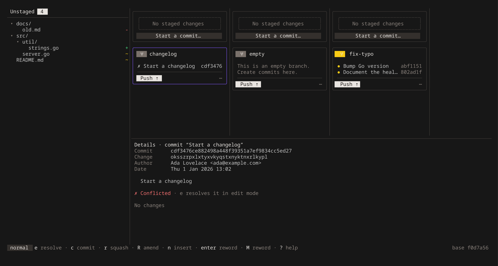
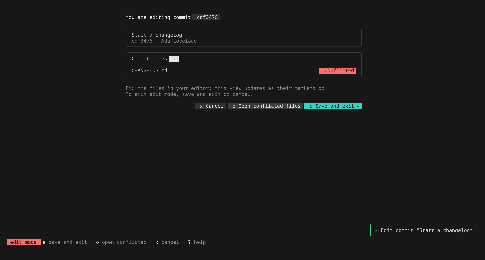
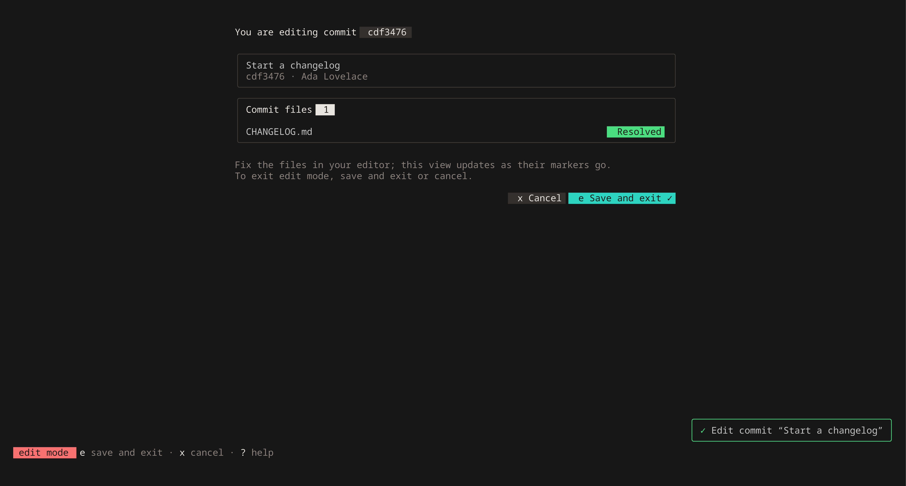

# Resolving conflicts

A pull, a move or a cherry-pick can leave a commit **conflicted**: GitButler finishes the rebase anyway and marks the
commit, and buti shows it with `✗` in its lane. You resolve it the way the
[desktop app](https://docs.gitbutler.com/features/branch-management/merging) does, in **edit mode**: buti checks the
commit out with conflict markers in its files, and you fix them in your own editor.

## 1. Select the commit and press `e`

The details pane says **✗ Conflicted**, and the status bar offers `e resolve`. Press `e`
(`but resolve <commit>`).

## 2. Fix the files in your editor

While the commit is checked out, buti shows it instead of the workspace: the commit, and its files, each
**Conflicted** or **Resolved**.

Open the files in any editor and remove the conflict markers (`<<<<<<<`, `|||||||`, `=======`, `>>>>>>>`), keeping
the content you want. From buti:

| Key | Does |
|---|---|
| `o` | open every conflicted file in `$EDITOR` |
| `enter` / double-click | open the selected file |
| `j` / `k` | select a file |

The screen refreshes by itself: a file turns **Resolved** once its markers are gone.

## 3. Save and exit, or cancel

| Key | Does |
|---|---|
| `e` | **save and exit** (`but resolve finish`): commit the resolution and rebase the commits above it. If a file still has markers, buti asks first, because they would be committed as they are. |
| `x` | **cancel** (`but resolve cancel --force`), after confirming: the commit stays conflicted and your edits are dropped |

The buttons under the files do the same when clicked. Undo a finished resolution with `u`.

## Good to know

- Your uncommitted changes are set aside while you're in edit mode, and come back when you save or cancel.
- In edit mode buti offers only these actions, plus `:` (run a `but` command), `!` (a shell command), `?`, `ctrl+p`
  and `ctrl+r`. Everything else waits until you're back in the workspace.
- With several conflicted commits in a branch, resolve the oldest first: finishing it rebases the ones above it.
- If you entered edit mode outside buti (or restarted buti during it), buti can't tell which commit is being edited,
  so the screen says "You are editing a conflicted commit" without the commit card.
