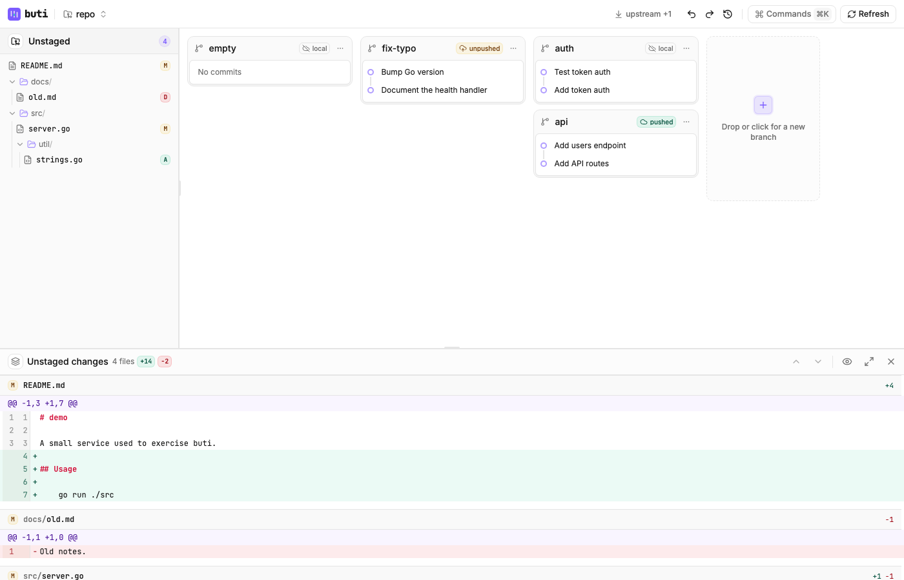

# Desktop

Tauri + React + shadcn/ui window on the Go core. `buti desktop` serves a localhost HTTP API and the webview calls it. The design is [ADR 0001](adr/0001-desktop-embedded-http.md) ([#52](https://github.com/BartInTheField/buti/issues/52)).

The workspace UI (#55) mirrors the TUI: an Unstaged tree, stack lanes with branch cards, and a details/diff pane. Drag a file onto a branch to commit, onto a commit to amend, or drag a commit onto Unstaged / another branch to uncommit or move. Every mutation goes through `internal/but`. The app uses the `but` already on `PATH`; it does not download or embed the GitButler CLI.

## Layout

- `cmd/buti` (`desktop` subcommand): flags, signals, then `internal/desktop`
- `internal/desktop`: loopback API and the code that starts the window
- `desktop/`: Vite, React, shadcn/ui, and the Tauri shell (`desktop/src-tauri`)

## Prerequisites

Both platforms:

- Go, the same toolchain as the rest of buti (`mise install`)
- Node.js 20 or newer, and npm
- Rust (stable) via [rustup](https://rustup.rs)
- GitButler's `but` on `PATH` if you want a real status. The window still opens without it and shows the install error.

### Linux

Tauri 2 needs WebKitGTK 4.1 and a few build libraries. On Debian or Ubuntu:

```sh
sudo apt update
sudo apt install libwebkit2gtk-4.1-dev build-essential curl wget file \
  libxdo-dev libssl-dev libayatana-appindicator3-dev librsvg2-dev patchelf
```

Fedora names differ (`webkit2gtk4.1-devel`, `gtk3-devel`, `libappindicator-gtk3-devel`, `librsvg2-devel`, `openssl-devel`). Use the [Tauri prerequisites](https://v2.tauri.app/start/prerequisites/) for the distro you are on.

A desktop session is required to see the window. The API itself does not need one: `buti desktop --serve` is enough to curl `/status`.

### macOS

Xcode Command Line Tools provide the macOS SDK and the linker:

```sh
xcode-select --install
```

Install Node and Rust the same way as on Linux (`node`, `rustup`). No extra GTK or WebKit package: Tauri uses the system WebKit.

## Install the frontend

From the repository root:

```sh
cd desktop
npm install
```

## Run

`-C` is the repository `but status` should read, same as the TUI. It goes before `desktop`; the other flags come after it.

Dev window (compiles the Rust shell on first run, then opens it against the embedded API):

```sh
go run ./cmd/buti -C . desktop --dev
# or: mise run desktop
```

API only, no window. The URL and bearer token are printed on stderr:

```sh
go run ./cmd/buti -C . desktop --serve
curl -sS -H "Authorization: Bearer <token>" http://127.0.0.1:<port>/status
```

Point the Vite dev server at that API from another terminal if you want the React screen in a browser:

```sh
cd desktop
BUTI_API_URL=http://127.0.0.1:<port> BUTI_API_TOKEN=<token> \
  VITE_BUTI_API_URL="$BUTI_API_URL" VITE_BUTI_API_TOKEN="$BUTI_API_TOKEN" \
  npm run dev
```

The webview reads `BUTI_API_URL` and `BUTI_API_TOKEN` from the environment through the `api_config` command. The browser fallback reads the `VITE_` pair. Do not put the token in the URL.

Built shell, after the build below:

```sh
go run ./cmd/buti -C . desktop --app desktop/src-tauri/target/release/buti-desktop
```

With no `--dev`, `--serve`, or `--app`, `buti desktop` looks for that binary (debug, then the macOS `.app` bundle) and starts it. `BUTI_DESKTOP_APP` overrides the path.

## Build

Frontend assets only (no Rust):

```sh
cd desktop
npm run build
```

Tauri shell. `beforeBuildCommand` runs `npm run build` first.

```sh
cd desktop
npm run tauri build
```

The binary is `desktop/src-tauri/target/release/buti-desktop`. macOS also produces `desktop/src-tauri/target/release/bundle/macos/Buti.app`. Linux produces a binary and, where the packaging tools are installed, a bundle under `target/release/bundle/`. Installers, signing, and updates are out of scope.

`npm run tauri build` does not look for `but` and does not copy it into the bundle.

## What the screen does

The window loads `GET /workspace` with [TanStack Query](https://tanstack.com/query) and shows the workspace: Unstaged files on the left, one lane per stack with branch cards and commits, and a diff pane for the selection. Drag-and-drop runs the same verbs as the TUI (commit / amend / move / uncommit) through `POST /ops/...`. If `but` is not on `PATH`, the screen shows that error and a link to the [GitButler CLI install docs](https://docs.gitbutler.com/cli-guides/installation). Refresh syncs pull requests and refetches the workspace, like ctrl+r in the TUI. The workspace is polled every 5 seconds, except during a drag.

Hovering a drop target never changes the layout: the hint is an overlay badge and the target only gets a ring. A file over a commit inside a branch card amends; the smallest target under the pointer that accepts the drag wins.

Keys, the command palette (cmd+k or ctrl+p), the help (`?`) and the right-click menus all come from one action registry in `desktop/src/actions/`, which mirrors `internal/ui/actions.go`. Space or cmd/ctrl-click marks files, commits or branches; actions and drags then act on all marks, and esc clears them.

### API

All routes except `/health` need the bearer token. Mutations take a JSON body, run one `but` command at a time, and reply `{"ok":true}` (plus `"output"` when `but` printed something) or `{"ok":false,"error":{...}}`.

| Route | Does |
| --- | --- |
| `GET /workspace` (`?sync=1`) | `but status`; with sync, pull requests are synced from the forge first |
| `GET /diff?id=` | the diff of a file, commit or branch, or all uncommitted changes |
| `GET /oplog`, `GET /branches`, `GET /review-url?branch=` | operation history, applied and unapplied branches, a branch's PR URL |
| `POST /ops/commit`, `empty-commit`, `amend`, `absorb`, `squash`, `reword`, `discard` | commits |
| `POST /ops/move`, `uncommit`, `pick` | move, uncommit, cherry-pick |
| `POST /ops/branch-new`, `branch-delete`, `apply`, `unapply`, `push`, `pull`, `pr-new`, `land`, `clean` | branches |
| `POST /ops/undo`, `redo`, `oplog-restore` | history |
| `POST /ops/resolve-start`, `resolve-finish`, `resolve-cancel` | edit mode for a conflicted commit |
| `POST /exec` | `{"line":"branch list"}` runs `but branch list`, like the TUI's `:` prompt |

`desktop/src/api.ts` has a typed function for each (`ops.<name>`), and `useWorkspaceOps().run(name, args)` calls one and refetches what it changed.

`GET /status` still returns the spike summary for curl and older callers.



## Tests

The Go API is covered by `go test ./internal/desktop` and does not need Node, Rust, or `but`. `mise run test` includes it. The Tauri window is not in CI.

`npm run e2e` (in `desktop/`) runs Playwright against the real screen: it builds the test repository, starts `buti desktop --serve` on it and Vite, then checks that hovering branch cards and commits during a drag never moves them, plus the palette, help, context menu and marks. It needs `but` and Go on `PATH` (it skips without `but`) and a Chromium from `npx playwright install chromium`. Screenshots go to `$BUTI_SHOTS`, by default `/tmp/buti-desktop-shots`.
